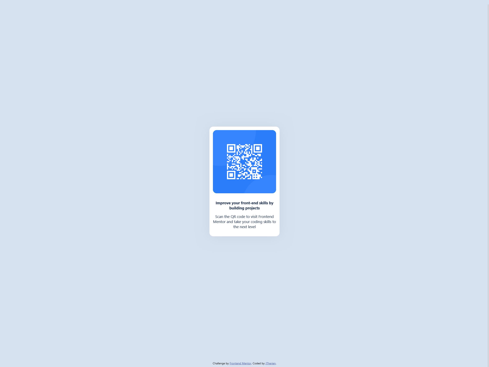

# Frontend Mentor - QR code component solution

This is a solution to the [QR code component challenge on Frontend Mentor](https://www.frontendmentor.io/challenges/qr-code-component-iux_sIO_H). Frontend Mentor challenges help you improve your coding skills by building realistic projects. 

## Table of contents

- [Overview](#overview)
  - [Screenshot](#screenshot)
  - [Links](#links)
- [My process](#my-process)
  - [Built with](#built-with)
  - [What I learned](#what-i-learned)
  - [Continued development](#continued-development)
  - [Useful resources](#useful-resources)
- [Author](#author)

**Note: Delete this note and update the table of contents based on what sections you keep.**

## Overview

### Screenshot

### Links

- Solution URL: [Add solution URL here](https://your-solution-url.com)
- Live Site URL: [Add live site URL here](https://your-live-site-url.com)

## My process

### Built with
- Flexbox
- CSS Grid

### What I learned

This is my first attempt at creating anything with css. I did some pre-reading on useful tools to familiarize myself with before jumping in and I settled on exploring CSS Grid and Flexbox.

Since this is my first forray into front-end development, I did have many training wheels in place. First was learning where to find the answers to my questions, and then when I struggled to formulate the right questions, I went to ChatGPT to help clearify what it was that I was really looking to accomplish.

### Continued development

I think an area of focus would be the proper way to structure CSS stylesheets as I feel the way I've organized my files does not feel optimal, or at a minimum, set up with very little thought.

### Useful resources

- [A Complete Guide to Flexbox: CSS-Tricks](https://css-tricks.com/snippets/css/a-guide-to-flexbox/)
- [A Complete Guide to CSS Grid](https://css-tricks.com/snippets/css/complete-guide-grid/)

## Author

- Github - [JTherien](https://github.com/JTherien)
